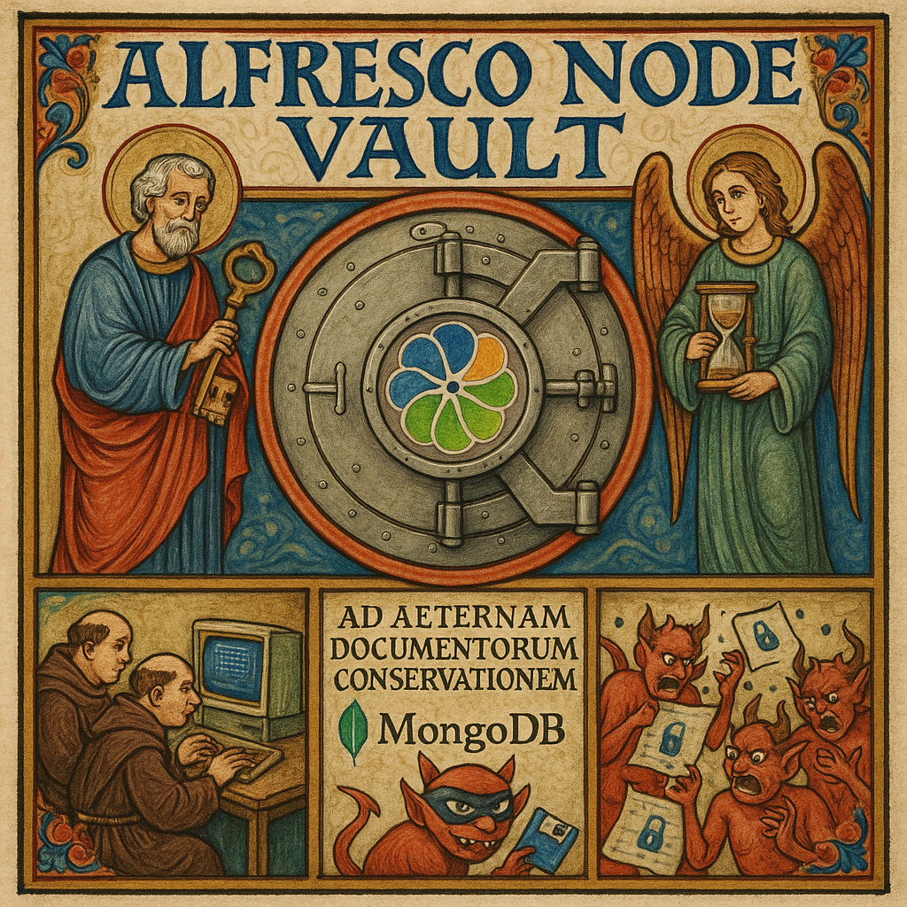
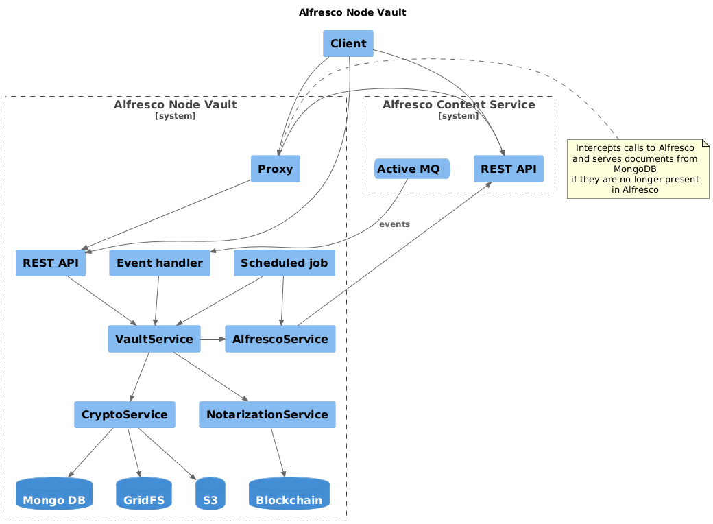

# Alfresco Node Vault

## The Long-term Document Management Challenge

Over the years, many Alfresco installations inevitably transform into increasingly slow and difficult-to-manage
repositories. The primary cause is the progressive accumulation of millions of nodes that burden the database, slow down
Solr queries, and compromise the overall performance of the system.

This situation is particularly common in organizations where:

- Effective corporate policies for archiving or deleting obsolete documents are missing
- Documents are retained indefinitely due to regulatory or compliance obligations
- Repository sizes grow exponentially year after year
- Users complain about increasingly longer response times in daily operations
- Infrastructure costs continually increase to support ever-larger repositories
- Maintenance operations (backup, indexing, upgrades) become progressively more complex and time-consuming

Repositories with hundreds of millions of nodes can require days for complete reindexing operations, or weeks for
migrations during version upgrades.

Many enterprises find themselves in a difficult position: business units demand that all documents remain accessible,
while IT departments struggle with managing increasingly unresponsive Alfresco instances. The technical debt
accumulates, making each upgrade more complex than the last. Site collections become sluggish, search operations time
out, and what was once a highly efficient ECM solution becomes a burden on daily operations.

## The solution: Alfresco Node Vault

A Spring Boot application designed for long-term storage of Alfresco nodes. Unlike traditional archiving solutions,
Alfresco Node Vault completely removes nodes from Alfresco and its database, freeing resources while maintaining
document accessibility.

The application can archive nodes on-demand through a behavior or using a scheduled job.

Nodes and binaries are archived on MongoDB with GridFS, ensuring efficient and scalable storage.

The application can also act as a proxy to allow applications using REST APIs to retrieve nodes that no longer exist in
Alfresco, ensuring operational continuity without the need to modify legacy client applications.

Furthermore, documents can also be automatically restored in Alfresco if required.

By implementing Alfresco Node Vault, organizations can:

- Maintain high performance in their active Alfresco repository
- Keep all historical documents accessible when needed
- Significantly reduce backup and maintenance windows
- Lower infrastructure costs by optimizing resource usage
- Simplify upgrade processes by reducing the volume of live data

This approach bridges the gap between complete document purging (often unacceptable for business or compliance reasons)
and the indefinite retention of all documents in the active repository (unsustainable from a performance perspective).

## Key Features
- Lean and elegant code architecture
- Fully FOSS, released under an open license
- Custom upload and download methods
- Scheduled or on-demand archiving
- MongoDB storage via GridFS
- Focus on [strong encryption](doc/Encryption.md) option for both content and metadata
- REST API with proxy support
- Engineered for flexibility and bespoke integrations
- No installation or changes required on Alfresco
- 100% test coverage
- Prometheus monitoring support for metrics and health checks
- Minimal memory footprint

Pull requests are welcome!

## Architecture

## Application global config

Global configuration is stored in `application.yml` file, the relevant parameters are:

| Parameter/env variable        | Default value                              | Purpose                                                             |
|-------------------------------|--------------------------------------------|---------------------------------------------------------------------|
| ALFRESCO_BASE_PATH            | http://localhost:8080                      | Scheme, host and port of the Alfresco server                        |
| ALFRESCO_USERNAME             | admin                                      | Alfresco user                                                       |
| ALFRESCO_PASSWORD             | admin                                      | Password for the Alfresco user                                      |
| ACTIVE_MQ_URL                 | tcp://localhost:61616                      | ActiveMQ broker URL                                                 |
| EVENT_HANDLER_ENABLED         | false                                      | Event based archive behaviour switch                                |
| ARCHIVING_JOB_ENABLED         | true                                       | Archiving scheduled job switch                                      |
| ARCHIVING_JOB_CRON_EXPRESSION | 0 0/5 2-6 * * ?                            | Scheduled job cron expression                                       |
| ARCHIVING_JOB_QUERY           | TYPE:'cm:content' AND ASPECT:'anv:archive' | Query for selecting documents to be archived                        |
| VAULT_HASH_ALGORITHM          | SHA-256                                    | Hash stored as metadata on GridFS                                   |
| VAULT_DOUBLE_CHECK            | true                                       | Double check content integrity before removing document on Alfresco |
| VAULT_ENCRYPTION_ENABLED      | true                                       | Enable content encryption                                           |
| VAULT_ENCRYPT_METADATA        | true                                       | Encrypt also metadata                                               |
| VAULT_ENCRYPTION_SECRET       | changeme                                   | Encryption secret                                                   |

## Build

Java and Maven required

`mvn package -DskipTests -Dlicense.skip=true`

Look at the `build.sh` or `build.bat` scripts for creating a convenient distribution package.

## Testing

For integration tests you can use `vault.(sh|bat)` script to start all needed containers, then

`mvn test`

will run the integration tests, and

`mvn test -Dtests=massive`

will run a load test.

## Run

`$ java -jar anv.jar`

## Documentation

The Javadoc is available at the following address: https://saidone75.github.io/alfresco-node-vault/

## License

Copyright (c) 2025 Saidone

Distributed under the GNU General Public License v3.0
